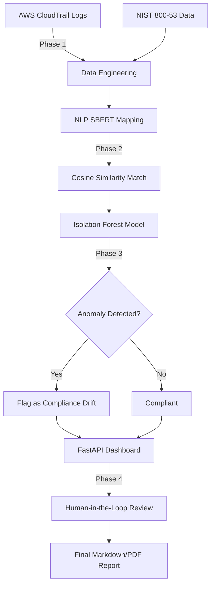

<div align="center">
  <h1>🛡️ GRC AI Automation Command Center</h1>
  <p>
    <b>An end-to-end Machine Learning pipeline that maps AWS CloudTrail logs to NIST 800-53 controls using NLP and detects compliance drift using Anomaly Detection.</b>
  </p>

  [](https://www.python.org/)
  [](https://fastapi.tiangolo.com)
  [](https://www.sbert.net/)
  [](https://scikit-learn.org/)
  [](https://www.docker.com/)
  [](https://opensource.org/licenses/MIT)

</div>

---

## 🌐 Live Demo

Access the hosted app here: [Hugging Face Space](https://huggingface.co/spaces/Yog965/grc-ai-command-deck)

Direct Web App link: [yog965-grc-ai-command-deck.hf.space](https://yog965-grc-ai-command-deck.hf.space)

## 📖 The Elevator Pitch

Governance, Risk, and Compliance (GRC) analysts spend hundreds of hours manually mapping cloud logs to regulatory frameworks and searching for compliance violations. **GRC AI Automation Command Center** solves this by using Machine Learning to automate the process.

This project features:
1. **Natural Language Processing (NLP)**: Uses **Sentence-BERT (`all-MiniLM-L6-v2`)** to semantically map unstructured AWS CloudTrail logs to **NIST SP 800-53 Rev 5** security controls.
2. **Machine Learning Anomaly Detection**: Trains an **Isolation Forest** model to detect "Compliance Drift" by flagging statistically anomalous log entries that represent potential security violations.
3. **Beautiful Glassmorphic Dashboard**: A fully responsive **FastAPI** web application with real-time job polling, dark-mode styling, and role-based access control.
4. **Human-in-the-Loop (HITL)**: Intelligently flags low-confidence SBERT predictions (< 70% similarity) for manual analyst review, combining AI efficiency with human accuracy.

---

## ⚡ Architecture



---

## 🚀 Features at a Glance

* **End-to-End Pipeline**: Handles data ingestion, ML mapping, anomaly scoring, and reporting in a single click.
* **Smart Caching Engine**: Custom SBERT embedding cache serialized to disk/memory for lightning-fast repeated runs.
* **Dynamic Thresholding**: The Isolation Forest automatically calculates optimal contamination thresholds based on the dataset.
* **Role-Based Access Control**: `admin`, `analyst`, and `reviewer` roles.
* **Modern UI**: Custom CSS with glassmorphism, responsive grids, and real-time toast notifications.

---

## 💻 Quick Start (Docker)

The absolute easiest way to run the application is via Docker Compose:

```bash
# 1. Clone the repository
git clone https://github.com/yourusername/grc-ai-command-center.git
cd grc-ai-command-center

# 2. Build and start the container
docker compose up --build
```

Access the dashboard at `http://localhost:8000`.

*(Demo Credentials: `demo_admin` / `GrcAI_Demo@2026`)*

---

## 🛠️ Local Development Setup

If you prefer to run it locally without Docker:

```bash
# 1. Create a virtual environment
python -m venv .venv

# 2. Activate it (Windows)
.venv\Scripts\activate
# Activate it (Mac/Linux)
source .venv/bin/activate

# 3. Install dependencies
pip install -r requirements.txt

# 4. Run the FastAPI Server
uvicorn app:app --reload
```

---

## 📊 The ML Pipeline Details

### Phase 1: Data Ingestion
Scrapes NIST SP 800-53 Rev 5 controls and generates synthetic AWS CloudTrail-style logs (representing both compliant actions and risky anomalies like "Root login without MFA").

### Phase 2: SBERT Mapping
We utilize the `sentence-transformers` library to convert both the NIST controls and the log descriptions into high-dimensional vector embeddings. We then calculate Cosine Similarity to find the Top-3 closest NIST controls for every single log.

### Phase 3: Isolation Forest
An unsupervised ML algorithm (`sklearn.ensemble.IsolationForest`) is trained on the numerical features of the mapped logs. It isolates observations by randomly selecting a feature and a split value. Logs that require fewer splits to be isolated are flagged as anomalies (score < -0.5).

### Phase 4: Human-in-the-Loop (HITL)
AI isn't perfect. If the highest SBERT similarity score is below `0.70`, the system halts and routes the log to a human analyst via the UI for manual mapping resolution.

---

## 🤝 Contributing
Contributions are welcome! Please feel free to submit a Pull Request or open an Issue.

## 📄 License
This project is licensed under the MIT License - see the [LICENSE](LICENSE) file for details.
